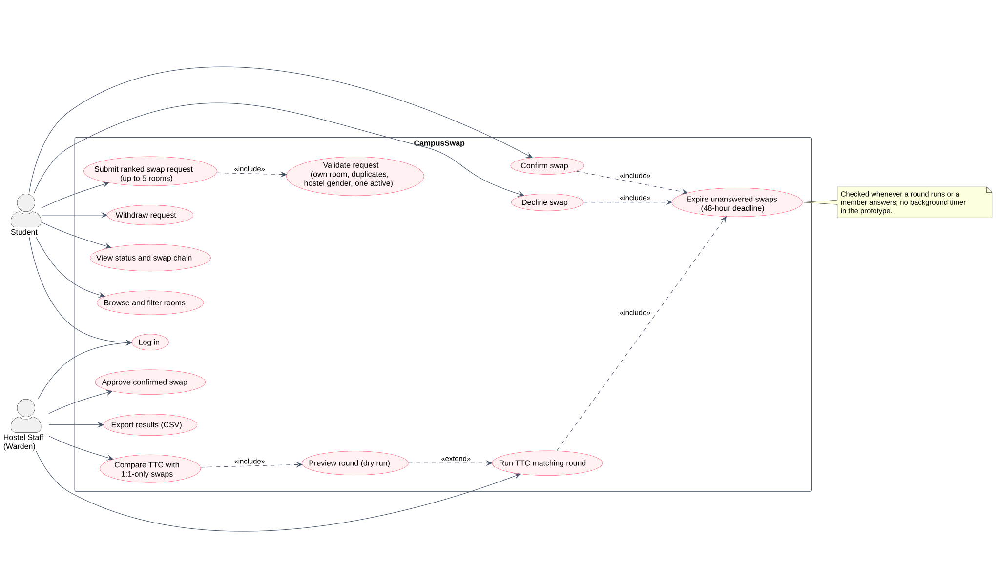
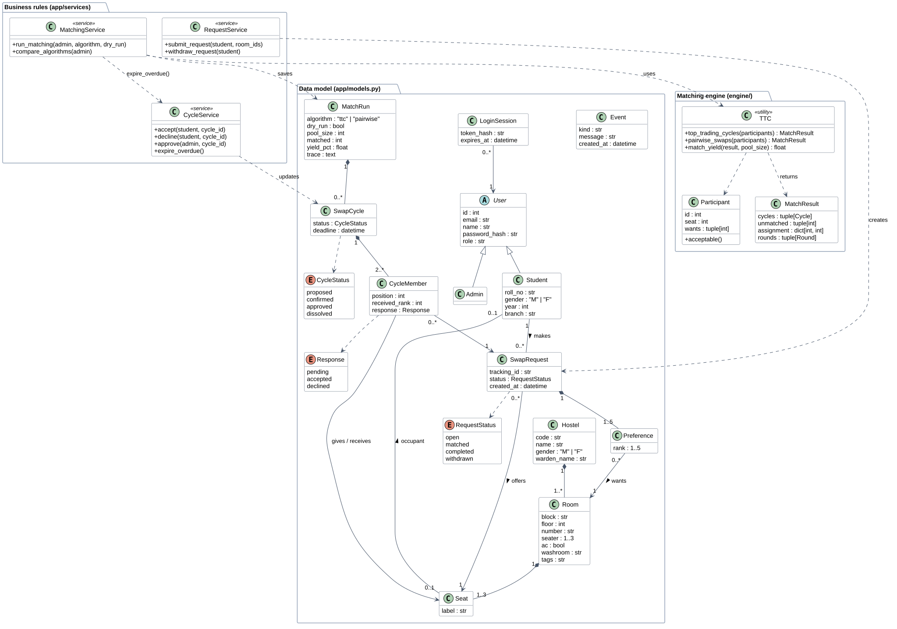
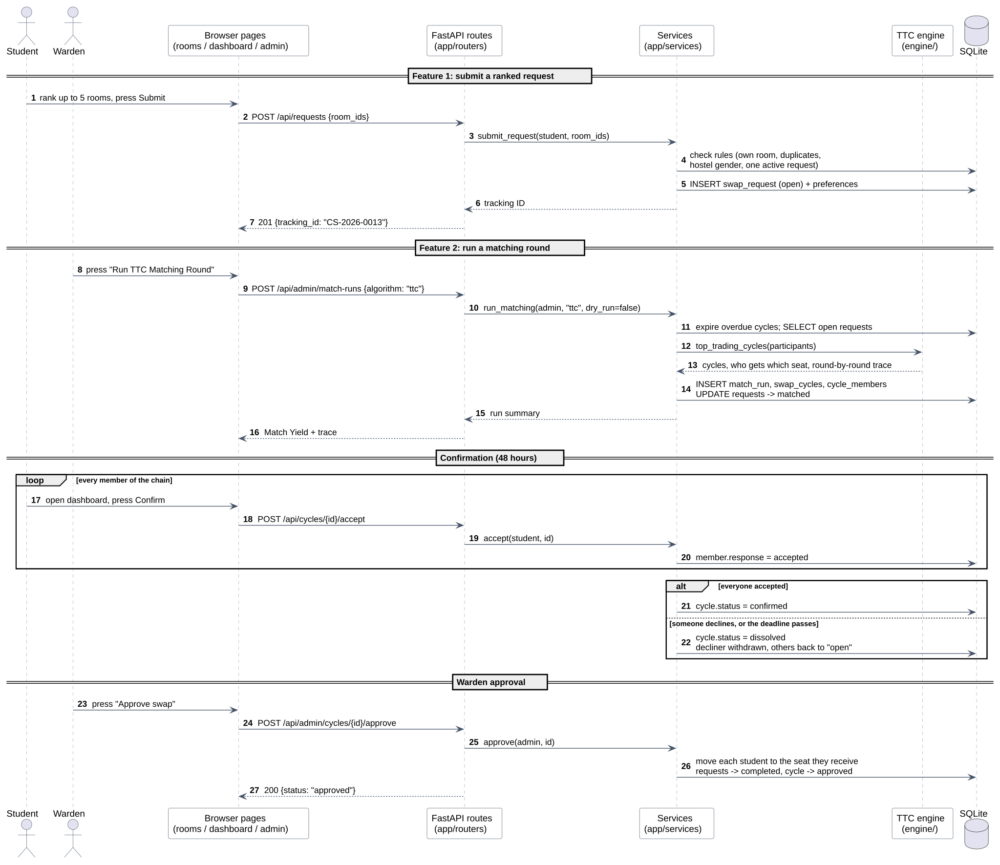
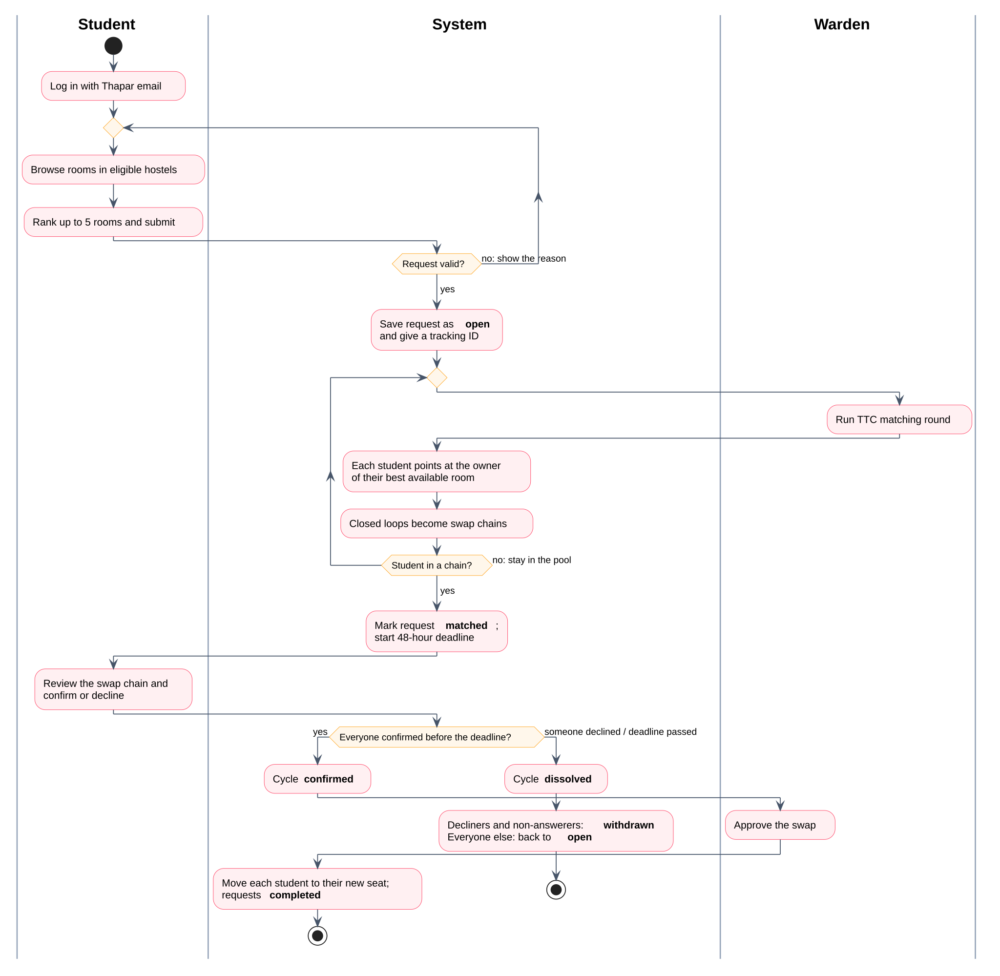

# Diagrams

Sources are in `diagrams/*.puml` (PlantUML text). Re-draw them with
`python diagrams/render.py`. Each diagram below comes with the reasons behind its
relationships, because the lab asks us to justify them.

## Use Case diagram

**Actors.** *Student* and *Hostel Staff (Warden)* are the two kinds of people who use the
system. There is no clock actor: in the prototype the 48-hour deadline is checked when
something happens, not by a timer.

**Why these relationships:**

- *Submit ranked swap request* **«include»** *Validate request*: every submission is
  always validated; it is a mandatory part of submitting, not an optional extra.
- *Run TTC matching round*, *Confirm swap* and *Decline swap* **«include»** *Expire
  unanswered swaps*: each of them first dissolves chains whose deadline has passed
  (see `expire_overdue()` in `services/cycles.py`).
- *Preview round (dry run)* **«extend»** *Run TTC matching round*: a dry run is an
  optional variation of running a round that the warden switches on; the base use case
  works without it.
- *Compare TTC with 1:1-only swaps* **«include»** *Preview round (dry run)*: a
  comparison always runs both methods as dry runs.

## Class diagram

**Why these relationships:**

- **Generalisation** *Student* and *Admin* → *User*: both log in the same way and share
  email, name and password hash; students add roll number, gender, year and branch.
- **Composition** (filled diamond) *Hostel* ◆— *Room* ◆— *Seat*: a room can't exist
  without its hostel, nor a seat without its room.
- **Composition** *SwapRequest* ◆— *Preference* (1..5): the ranked choices belong to one
  request and have no meaning on their own.
- **Composition** *MatchRun* ◆— *SwapCycle* ◆— *CycleMember* (2..*): a chain is produced
  by one run and always has at least two members.
- **Association** *Seat* — *Student* (0..1 to 0..1): a bed has at most one occupant, and a
  student has at most one bed. It's an association, not composition, because students
  exist on their own and move between seats.
- **Dependencies** (dashed arrows) from the services: *MatchingService* uses the *TTC*
  engine and calls *CycleService*'s `expire_overdue()`. They don't store each other, so
  these are dependencies, not associations.

## Sequence diagram

One swap from start to finish: feature 1 (submit), feature 2 (run a round), the
confirmation **loop** over every chain member, the **alt** block for "everyone accepted"
versus "someone declined / deadline passed", and the warden's approval. Messages follow
the real layers: page → route → service → engine or database.

## Activity diagram

The life of one swap request, with swimlanes for *Student*, *System* and *Warden*. Two
loops show what happens when things don't work first time: an invalid request goes back to
browsing, and a student not placed in a chain stays in the pool for the next round. The
final decision shows the two ways a proposed swap can end: **confirmed then approved**, or
**dissolved**.
